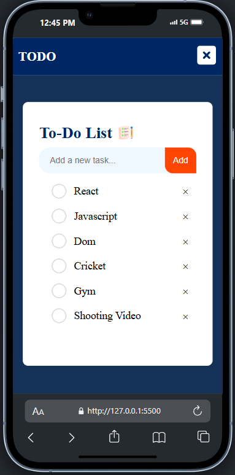

# 📋 To-Do List Web App

A clean and simple To-Do List web application built using **HTML**, **CSS**, and **JavaScript**. This project is designed with a mobile-first approach and is fully responsive, ensuring smooth functionality and layout across all screen sizes – from mobile phones to desktops.


## 🌟 Features

- ✅ Add and delete tasks
- 📝 Mark tasks as completed
- 📱 Mobile-first responsive design
- 💡 Lightweight, no external libraries or frameworks used
- ⚡ Fast and easy to use UI


## 📷 Screenshots

| Mobile View | Desktop View |
|-------------|--------------|
|  |  |


## 🔧 Tech Stack

- **HTML5** – Structure
- **CSS3** – Styling and layout
- **Vanilla JavaScript** – Functionality and interactivity


## 📱 Mobile-First Design

This application is built with a mobile-first approach, which means:

- Optimized for small screen sizes by default
- Uses responsive units (%, em, rem) and media queries for flexibility
- Looks great and functions perfectly on all devices


## 🚀 Getting Started

### 1. Clone the repository

```bash
git clone https://github.com/your-username/Todo-List-Project.git
